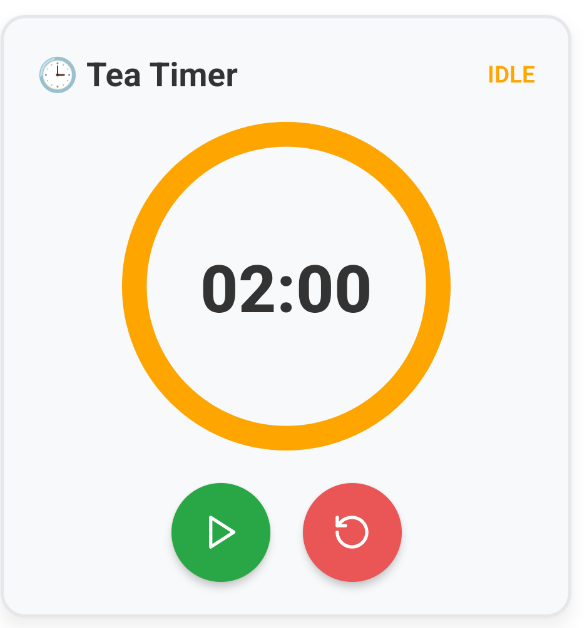
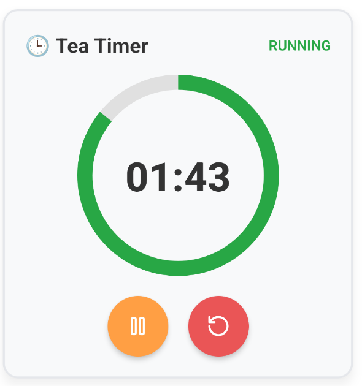
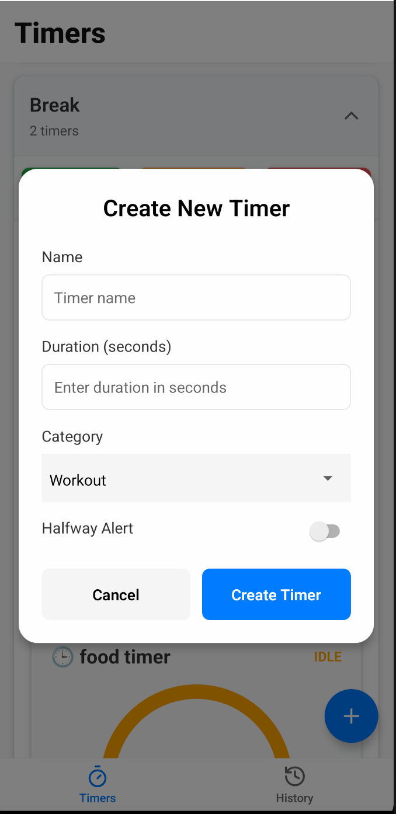
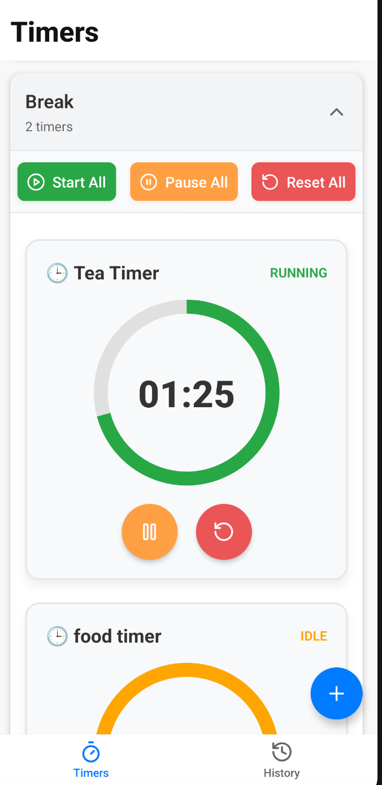
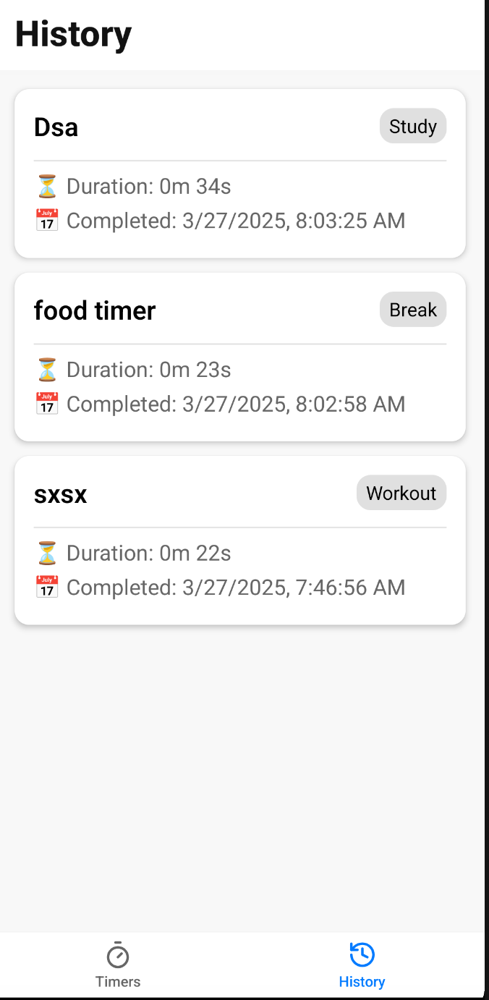

Here’s a more compact version:

---

# React Native Timer App

A simple timer app with customizable timers, categories, and progress tracking.

## Features

-   **Timers**: Create, start, pause, reset, complete.
-   **Categories**: Grouped expandable timer lists.
-   **Progress**: Visualized with bars.
-   **Bulk Actions**: Control timers by category.
-   **Alerts & Feedback**: Halfway alerts, completion modals.
-   **History Log**: Stores completed timers.
-   **Persistence**: Saves data with AsyncStorage.
-   **Navigation**: Home & History screens.

## Screenshots

|               Timer               |            Running Timer            |            Create Timer            |
| :-------------------------------: | :---------------------------------: | :--------------------------------: |
|  |  |  |

|                Timer List                 |               History               |          Completion Modal           |
| :---------------------------------------: | :---------------------------------: | :---------------------------------: |
|  |  |  |

## Installation

1. **Clone & Install**
    ```sh
    git clone <repo-url> && cd <folder>
    npm install
    ```
2. **Run the App**
    ```sh
    expo start
    ```

## APK Installation

1. **APK Installation**
    ```sh
    adb install release/app-release.apk
    ```

## Author

**Subham Swarup Pradhan**
